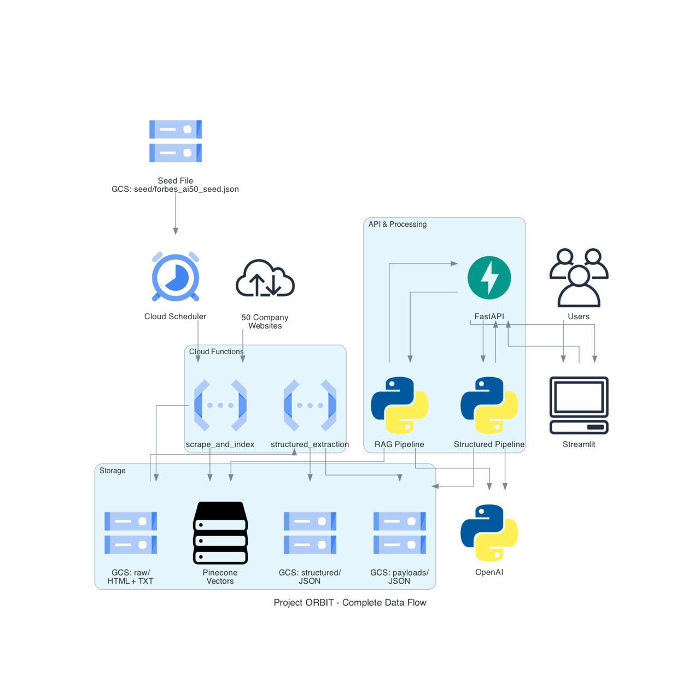
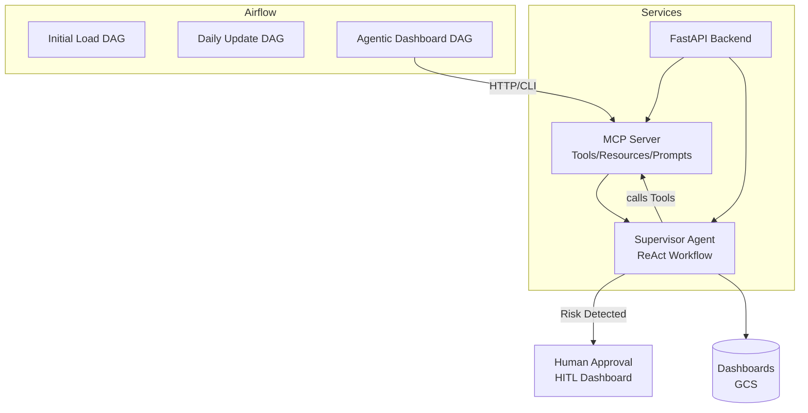
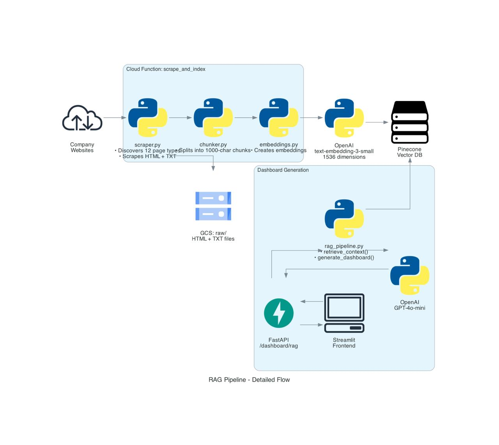
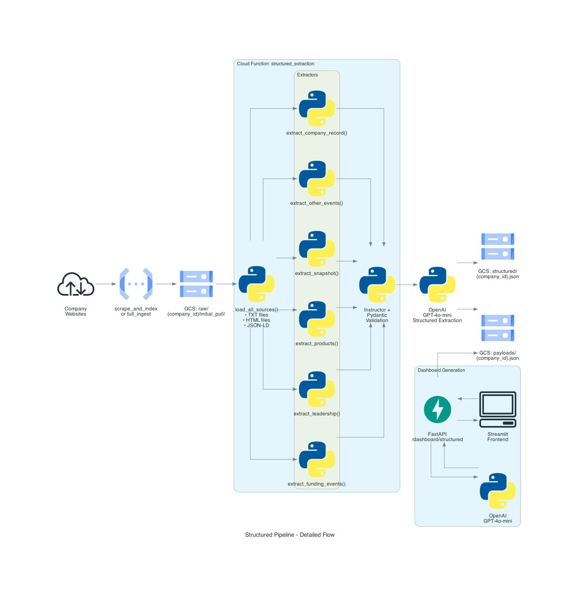
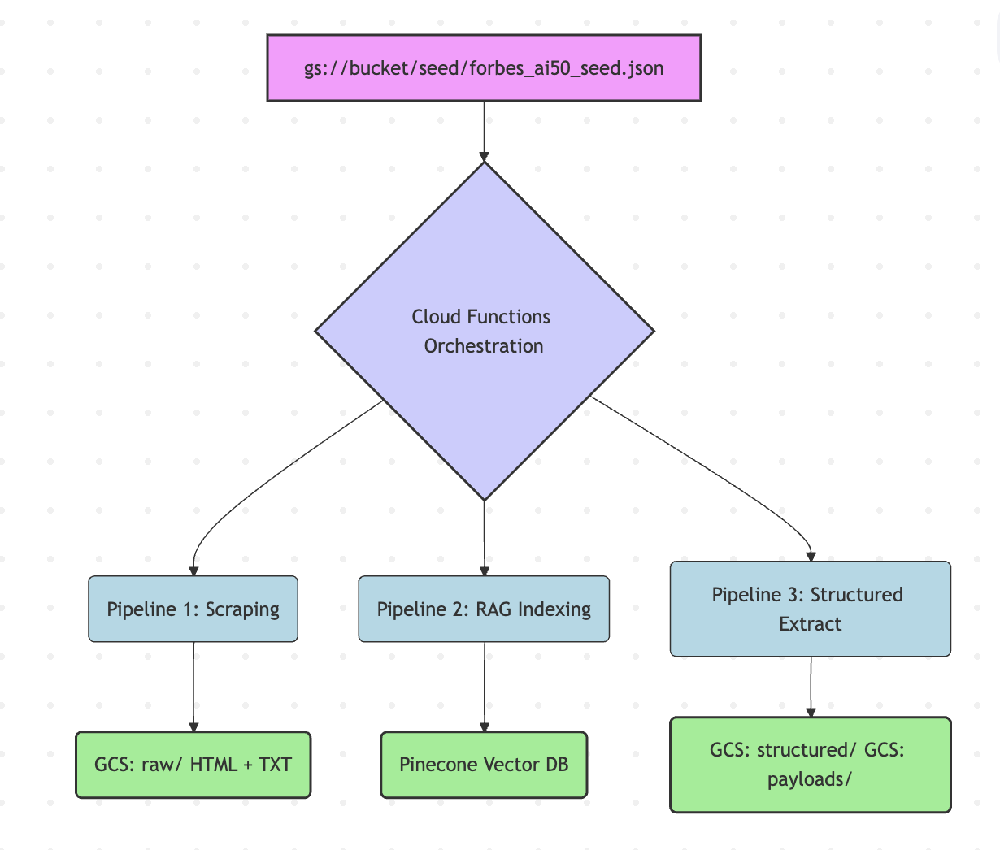

# Project ORBIT (Complete Version)- Private Equity Intelligence for Forbes AI 50

**Agentic, Production-Ready PE Intelligence Platform**

Automating Private-Equity (PE) Intelligence for the Forbes AI 50

**Project ORBIT** is a comprehensive, cloud-hosted system that automates private-equity intelligence gathering and analysis for the Forbes AI 50 startups. The platform has evolved from a static ETL pipeline (Assignment 4) to an **agentic, reasoning-based system** (Assignment 5) that:

- **Orchestrates due-diligence workflows** through supervisory LLM agents
- **Standardizes tool access** with the Model Context Protocol (MCP)
- **Employs ReAct reasoning** for transparent decision-making
- **Runs under Airflow orchestration** with containerized MCP services
- **Pauses for Human-in-the-Loop (HITL)** review when risks are detected

- [Application URL]()
- [Backend URL]()
- [Scheduler URL]()
- [Codelabs URL]()
- [Video Link]()

---

## Problem Statement

Private equity analysts currently perform manual research on Forbes AI 50 companies by visiting websites, LinkedIn pages, and press releases to collect investment signals. This process:
- Doesn't scale to all 50 companies
- Is difficult to refresh daily
- Creates inconsistency across analysts
- Is time-consuming and error-prone

**Project ORBIT** solves this by automating the entire intelligence pipeline from data ingestion to dashboard generation, now enhanced with agentic reasoning and secure tool integration.

---

## Architecture

### System Architecture Diagram



### Agentic Architecture (Assignment 5)



### Core Components

#### 1. **MCP Server** (`src/mcp/`)
- **Purpose**: Exposes standardized tools, resources, and prompts via HTTP
- **Endpoints**:
  - `/tool/*` - Agent tools (get_latest_structured_payload, rag_search_company, report_layoff_signal)
  - `/resource/*` - Company data, payloads, risk signals
  - `/prompt/*` - Reusable prompt templates
- **Port**: 8001
- **Docker**: `Dockerfile.mcp`

#### 2. **Supervisor Agent** (`src/agents/supervisor.py`)
- **Purpose**: Orchestrates dashboard generation using ReAct pattern
- **Features**:
  - Thought → Action → Observation loop
  - Structured logging with correlation IDs
  - MCP client integration for tool calls
- **Model**: GPT-4o-mini (configurable)

#### 3. **Workflow Graph** (`src/agents/workflow.py`)
- **Purpose**: Graph-based workflow with conditional branching
- **Nodes**:
  - **Planner**: Constructs dashboard strategy
  - **Data Generator**: Invokes MCP dashboard tools
  - **Risk Detector**: Analyzes content for risk signals
  - **HITL Pause**: Requests human approval when risks detected
  - **Evaluator**: Validates and finalizes dashboard
- **Diagram**: See [docs/WORKFLOW_GRAPH.md](./docs/WORKFLOW_GRAPH.md)

#### 4. **ReAct Pattern Implementation**
- **Thought**: LLM reasoning about next action
- **Action**: Tool selection and invocation
- **Observation**: Tool result and context update
- **Logging**: Structured JSON traces (see [docs/REACT_TRACE_EXAMPLE.md](./docs/REACT_TRACE_EXAMPLE.md))

#### 5. **Human-in-the-Loop (HITL)**
- **Purpose**: Pause workflow for human review when risks detected
- **Interface**: Streamlit dashboard (`src/hitl_dashboard.py`)
- **Port**: 8502
- **Features**: Approve/reject workflows, view risk signals, resume execution

### Two Parallel Generation Pipelines

#### 1. **RAG Pipeline** (Unstructured)
```
Raw Website Data → Text Chunks → Embeddings → Pinecone Vector DB → LLM → PE Dashboard
```


#### 2. **Structured Pipeline** (Pydantic + Instructor)
```
Raw Website Data → Pydantic Models → JSON Payload → LLM → PE Dashboard
```


### Data Flow



---

## Project Structure

```
project_orbit/
├── cloud_functions/        # Cloud Functions (Lab 2 & 3 - Scraping automation)
│   ├── main.py            # Function entry points
│   ├── requirements.txt   # Function dependencies
│   └── src/               # Scraper and GCS utilities
├── dags/                  # Airflow DAGs
│   ├── orbit_initial_load_dag.py
│   ├── orbit_daily_update_dag.py
│   └── orbit_agentic_dashboard_dag.py  # Assignment 5
├── src/
│   ├── agents/             # Assignment 5: Agent Infrastructure
│   │   ├── supervisor.py   # Supervisor Agent
│   │   ├── workflow.py     # Workflow Graph
│   │   ├── tools.py        # Core agent tools
│   │   ├── mcp_client.py   # MCP client
│   │   └── cloud_logging.py # Structured logging
│   ├── mcp/                # Assignment 5: MCP Server
│   │   ├── server.py       # FastAPI MCP server
│   │   ├── handlers/       # Tool/Resource/Prompt handlers
│   │   └── models.py        # MCP protocol models
│   ├── api.py              # FastAPI backend
│   ├── agent_service.py    # Agent HTTP service
│   ├── hitl_dashboard.py  # HITL Streamlit app
│   └── streamlit_app.py    # Main Streamlit frontend
├── tests/                  # Assignment 5: Testing
│   ├── test_tools.py       # Lab 12: Tool tests
│   ├── test_mcp_server.py  # Lab 14: MCP tests
│   ├── test_workflow_branches.py  # Lab 17: Workflow tests
│   └── test_supervisor_agent.py
├── docs/
│   ├── REACT_TRACE_EXAMPLE.md  # Lab 16: ReAct traces
│   ├── WORKFLOW_GRAPH.md       # Lab 17: Workflow diagram
│   ├── mcp.md                  # MCP documentation
│   └── hitl_quick_start.md     # HITL dashboard guide
├── Dockerfile.mcp          # Assignment 5: MCP Server
├── Dockerfile.agent        # Assignment 5: Agent Service
├── Dockerfile.hitl         # HITL Dashboard
├── Dockerfile.api         # FastAPI Backend
├── Dockerfile.streamlit    # Streamlit Frontend
├── docker-compose.yml      # Multi-container setup
├── docker-compose.airflow.yml  # Airflow setup
└── .env.example            # Environment configuration
```

---

## Quick Start

### Prerequisites

- Python 3.11+
- Docker & Docker Compose
- Google Cloud SDK (`gcloud` CLI)
- OpenAI API Key
- Pinecone API Key (for vector DB)

### 1. Clone & Setup

```bash
git clone https://github.com/your-username/project-orbit.git
cd project-orbit
```

### 2. Environment Configuration

```bash
# Copy environment template (if .env.example exists)
# Otherwise, create .env with required variables

# Required variables:
# - OPENAI_API_KEY
# - PINECONE_API_KEY
# - PINECONE_INDEX
# - GCS_BUCKET_NAME
# - MCP_API_KEY (optional, defaults to dev mode)
```

### 3. Docker Compose (Recommended)

Start all services with Docker Compose:

```bash
docker-compose up --build
```

**Services**:
- **MCP Server**: http://localhost:8001
- **Agent Service**: http://localhost:8002
- **FastAPI**: http://localhost:8000
- **Streamlit**: http://localhost:8501
- **HITL Dashboard**: http://localhost:8502

### 4. Local Development (Alternative)

```bash
# Install dependencies
pip install -r requirements.txt

# Start MCP Server (in one terminal)
cd src/mcp
uvicorn server:app --host 0.0.0.0 --port 8001

# Start Agent Service (in another terminal)
cd src
uvicorn agent_service:app --host 0.0.0.0 --port 8002

# Start FastAPI (in another terminal)
uvicorn src.api:app --reload --host 0.0.0.0 --port 8000

# Start Streamlit (in another terminal)
streamlit run src/streamlit_app.py --server.port 8501
```

### Lab 2 & 3: Cloud Functions + Cloud Scheduler

For detailed setup instructions, see [CLOUD_FUNCTIONS_DOCUMENTATION.md](./CLOUD_FUNCTIONS_DOCUMENTATION.md)

**Quick steps:**
1. Enable APIs: `bash scripts/enable_apis.sh`
2. Copy source code: `cp -r src cloud_functions/src`
3. Set bucket config: `echo 'BUCKET_NAME="project-orbit-data-12345"' > .gcs_config`
4. Deploy functions: `bash scripts/deploy_functions.sh`
5. Create schedulers: `bash scripts/create_schedulers.sh`

**Functions**:
- **full_ingest**: Full-load scraping for all 50 companies (manual trigger)
- **daily_refresh**: Daily refresh of key pages (runs at 3 AM UTC)

---

## Testing

### Run All Tests

```bash
pytest -v --maxfail=1 --disable-warnings
```

### Individual Test Suites

```bash
# Test core tools (Lab 12)
pytest tests/test_tools.py -v

# Test MCP server (Lab 14)
pytest tests/test_mcp_server.py -v

# Test workflow branches (Lab 17)
pytest tests/test_workflow_branches.py -v

# Test supervisor agent
pytest tests/test_supervisor_agent.py -v
```

### Test Coverage

- Core agent tools return expected schemas
- MCP endpoints return valid responses
- Workflow branches correctly (risk vs no-risk)
- ReAct pattern logs structured traces

### Testing Commands

```bash
# Test API health
curl http://localhost:8000/health

# Test company listing
curl http://localhost:8000/companies

# Test dashboard generation
curl -X POST "http://localhost:8000/dashboard/rag" \
  -H "Content-Type: application/json" \
  -d '{"company_name": "Anthropic"}'

# Test MCP server
curl http://localhost:8001/health
curl http://localhost:8001/tool/list

# Test agent service
curl http://localhost:8002/health
```

---

## Configuration

### Environment Variables

Key environment variables (see `.env.example` if available):

```bash
# LLM Configuration
OPENAI_API_KEY=sk-...
LLM_MODEL=gpt-4o-mini

# Vector Database
PINECONE_API_KEY=...
PINECONE_INDEX=project-orbit

# MCP Server
MCP_API_KEY=your-secure-key  # Optional, enables auth
MCP_BASE=http://localhost:8001

# GCP Configuration
GCS_BUCKET_NAME=project-orbit-data-12345
PROJECT_ID=your-project-id

# Agent Configuration
MAX_ITERATIONS=10
ENABLE_LLM_REASONING=true
```

### MCP Configuration

MCP client configuration is handled via environment variables. The Supervisor Agent automatically connects to the MCP server using `MCP_BASE` and `MCP_API_KEY`.

---

## Airflow Integration

### DAGs Overview

1. **`orbit_initial_load_dag`**: Initial data load and payload assembly
   - Schedule: `@once` (manual trigger)
   - Loads company seed data
   - Scrapes all companies
   - Generates initial payloads

2. **`orbit_daily_update_dag`**: Incremental updates
   - Schedule: `0 3 * * *` (3 AM daily)
   - Refreshes key pages
   - Updates vector database
   - Regenerates changed payloads

3. **`orbit_agentic_dashboard_dag`**: Agentic dashboard generation
   - Schedule: `0 2 * * *` (2 AM daily)
   - Invokes Supervisor Agent workflow for all companies
   - Handles HITL approvals
   - Stores dashboards to GCS

### Running Airflow Locally

```bash
# Using Docker Compose
docker-compose -f docker-compose.airflow.yml up

# Access Airflow UI
# http://localhost:8080
# Default credentials: airflow/airflow
```

### Airflow Variables

Set these in Airflow UI or via CLI:

```bash
# Set Airflow Variables
airflow variables set GCS_BUCKET_NAME "project-orbit-data-12345"
airflow variables set MCP_SERVER_URL "http://mcp:8001"
airflow variables set MCP_API_KEY "your-key"
airflow variables set OPENAI_API_KEY "sk-..."
```

---

## Observability & Logging

### Structured Logging

The system uses structured JSON logging for ReAct traces:

```json
{
  "timestamp": "2025-01-21T10:30:00Z",
  "run_id": "abc123",
  "company_id": "anthropic",
  "step_number": 1,
  "thought": "I need to retrieve the latest payload...",
  "action": "get_latest_structured_payload",
  "observation": "Retrieved payload with 8 sections...",
  "error": null
}
```

### View ReAct Traces

- **Local**: Check `logs/` directory or stdout
- **Cloud Logging**: See [docs/cloud_logging_react_traces.md](./docs/cloud_logging_react_traces.md)
- **Example Trace**: See [docs/REACT_TRACE_EXAMPLE.md](./docs/REACT_TRACE_EXAMPLE.md)

### Monitoring

- **MCP Server**: http://localhost:8001/health
- **Agent Service**: http://localhost:8002/health
- **FastAPI**: http://localhost:8000/health

### Cloud Functions Logs

```bash
# View function logs
gcloud functions logs read {function_name} \
  --gen2 \
  --region=us-central1 \
  --limit=50
```

### Cloud Run Logs

```bash
# View service logs
gcloud logging read "resource.type=cloud_run_revision AND resource.labels.service_name=project-orbit-api" \
  --limit 50
```

### GCS Verification

```bash
# Check scraped data
gsutil ls -r gs://your-bucket/raw/

# View structured data
gsutil cat gs://your-bucket/structured/{company_id}.json | python3 -m json.tool
```

---

## API Endpoints

### FastAPI Endpoints

- **`GET /`** - API root with service information
- **`GET /companies`** - List all Forbes AI 50 companies
- **`POST /dashboard/rag`** - Generate RAG-based PE dashboard
- **`POST /dashboard/structured`** - Generate structured-based PE dashboard
- **`GET /health`** - Health check endpoint

### Agent Service Endpoints

- **`POST /agent/execute`** - Execute agent query with ReAct workflow
- **`GET /agent/health`** - Agent service health check

### MCP Server Endpoints

- **`GET /tool/list`** - List all available tools
- **`POST /tool/call`** - Execute a tool call
- **`GET /resource/list`** - List all available resources
- **`POST /resource/read`** - Read a resource by URI
- **`GET /prompt/list`** - List all available prompts
- **`POST /prompt/get`** - Get a prompt template
- **`GET /health`** - MCP server health check

### Dashboard Schema

Both pipelines generate dashboards with 8 required sections:

1. **Company Overview**
2. **Business Model and GTM**
3. **Funding & Investor Profile**
4. **Growth Momentum**
5. **Visibility & Market Sentiment**
6. **Risks and Challenges**
7. **Outlook**
8. **Disclosure Gaps**

**Rules**:
- Use literal "Not disclosed." for missing fields
- Never invent ARR/MRR/valuation/customer logos
- Always include final Disclosure Gaps section

---

## Deployment

### Automated GCP Deployment

```bash
# Deploy everything to GCP
./deploy_gcp.sh
```

This script:
- Validates environment variables
- Creates/verifies service accounts
- Sets up IAM permissions
- Builds Docker image with Cloud Build
- Deploys FastAPI and Streamlit to Cloud Run

### Manual Deployment Steps

1. **Build Docker Images**:
   ```bash
   # MCP Server
   docker build -f Dockerfile.mcp -t gcr.io/$PROJECT_ID/project-orbit-mcp .
   
   # Agent Service
   docker build -f Dockerfile.agent -t gcr.io/$PROJECT_ID/project-orbit-agent .
   
   # FastAPI
   gcloud builds submit --tag gcr.io/$PROJECT_ID/project-orbit:latest
   ```

2. **Deploy MCP Server**:
   ```bash
   gcloud run deploy project-orbit-mcp \
     --image gcr.io/$PROJECT_ID/project-orbit-mcp \
     --platform managed \
     --region us-central1 \
     --port 8001 \
     --set-env-vars="MCP_API_KEY=$MCP_API_KEY,OPENAI_API_KEY=$OPENAI_API_KEY,..."
   ```

3. **Deploy Agent Service**:
   ```bash
   gcloud run deploy project-orbit-agent \
     --image gcr.io/$PROJECT_ID/project-orbit-agent \
     --platform managed \
     --region us-central1 \
     --port 8002 \
     --set-env-vars="MCP_BASE=$MCP_SERVER_URL,MCP_API_KEY=$MCP_API_KEY,..."
   ```

4. **Deploy FastAPI**:
   ```bash
   gcloud run deploy project-orbit-api \
     --image gcr.io/$PROJECT_ID/project-orbit:latest \
     --platform managed \
     --region us-central1 \
     --service-account=project-orbit-sa@${PROJECT_ID}.iam.gserviceaccount.com \
     --set-env-vars="GCS_BUCKET_NAME=$GCS_BUCKET_NAME,PROJECT_ID=$PROJECT_ID,..."
   ```

5. **Deploy Streamlit**:
   ```bash
   gcloud run deploy project-orbit-streamlit \
     --image gcr.io/$PROJECT_ID/project-orbit:latest \
     --platform managed \
     --region us-central1 \
     --service-account=project-orbit-sa@${PROJECT_ID}.iam.gserviceaccount.com \
     --set-env-vars="API_BASE=<fastapi-url>"
     --command streamlit --args "run,src/streamlit_app.py,--server.port,8501,--server.address,0.0.0.0"
   ```

---

## Demo Video

[Link to demo video showing workflow execution + HITL pause/resume]

**Key Features Demonstrated**:
1. Agentic workflow execution
2. ReAct reasoning loop
3. Risk detection triggering HITL
4. Human approval via HITL dashboard
5. Workflow resumption after approval

---

## Documentation

- **[MCP Implementation](./docs/mcp_implementation_summary.md)**: MCP server details
- **[Workflow Graph](./docs/WORKFLOW_GRAPH.md)**: Graph-based workflow documentation
- **[ReAct Traces](./docs/REACT_TRACE_EXAMPLE.md)**: Example ReAct trace logs
- **[HITL Quick Start](./docs/hitl_quick_start.md)**: HITL dashboard guide
- **[Architecture Diagrams](./docs/ARCHITECTURE_DIAGRAM.md)**: System architecture details
- **[MCP API Usage](./docs/mcp_api_usage.md)**: MCP client integration guide

---

## Production Readiness Checklist

- [x] Working Airflow DAGs for initial/daily/agentic runs
- [x] MCP Server + Agent run via Docker Compose
- [x] Config and secrets loaded from .env
- [x] Structured ReAct logging (JSON)
- [x] ≥3 automated pytest tests
- [x] Setup and run instructions in README
- [x] Demo video showing HITL pause/resume
- [x] System diagram and architecture summary

---

## Assignment 5 Deliverables

### Phase 1: Agent Infrastructure
- Lab 12: Core agent tools with Pydantic models
- Lab 13: Supervisor Agent with ReAct pattern

### Phase 2: MCP Integration
- Lab 14: MCP Server with Tools/Resources/Prompts
- Lab 15: Agent MCP consumption

### Phase 3: Advanced Implementation
- Lab 16: ReAct pattern with structured logging
- Lab 17: Supervisory workflow pattern (graph-based)
- Lab 18: HITL integration & visualization

### Phase 4: Orchestration
- Airflow DAGs integration
- Containerization (Dockerfiles + docker-compose)
- Configuration management (.env + config/)

---

## Tech Stack

### Core Technologies
- **Backend**: Python 3.11, FastAPI, Uvicorn
- **Frontend**: Streamlit
- **Containerization**: Docker, Docker Compose
- **Orchestration**: Apache Airflow
- **Cloud Platform**: Google Cloud Platform (GCP)
- **Agent Framework**: LangChain v1 / Custom ReAct implementation
- **Workflow**: Graph-based workflow (LangGraph-style)

### GCP Services
- **Cloud Storage (GCS)**: Raw data, structured JSON, payloads
- **Cloud Run**: Containerized FastAPI + Streamlit deployment
- **Cloud Functions**: Serverless data processing pipelines
- **Secret Manager**: Secure API key storage
- **Cloud Logging & Monitoring**: Observability
- **Cloud Build / Container Registry**: CI/CD and image storage

### Data Processing
- **Vector Database**: Pinecone
- **LLM**: OpenAI GPT-4o-mini
- **Embeddings**: OpenAI text-embedding-3-small
- **Structured Extraction**: Instructor + Pydantic models
- **Web Scraping**: requests, BeautifulSoup, trafilatura, Playwright

---

## Evaluation & Quality Assurance

The project includes comprehensive evaluation of both pipelines:

- **Factual Correctness**: Accuracy of extracted information
- **Schema Adherence**: Proper 8-section dashboard structure
- **Provenance Tracking**: Source attribution for all data
- **Hallucination Control**: Zero fabrication of information
- **Readability**: Investor-friendly presentation
- **ReAct Transparency**: Structured logging of reasoning steps
- **Risk Detection**: Automated flagging of concerning signals

---

## Contributing

See [CONTRIBUTION_ATTESTATION.txt](./CONTRIBUTION_ATTESTATION.txt) for contribution guidelines.

---

## License

[Your License]

---

## Acknowledgments

Built for DAMG 7245 - Assignment 5: Agentification and Secure Scaling of PE Intelligence using MCP

