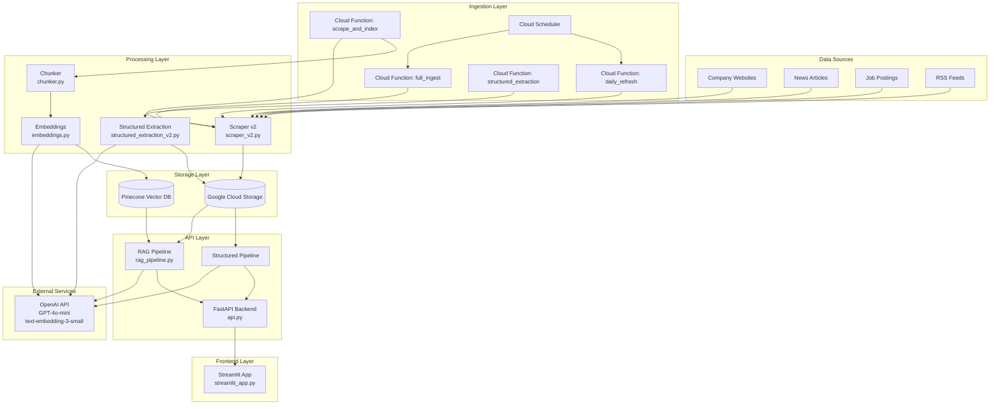
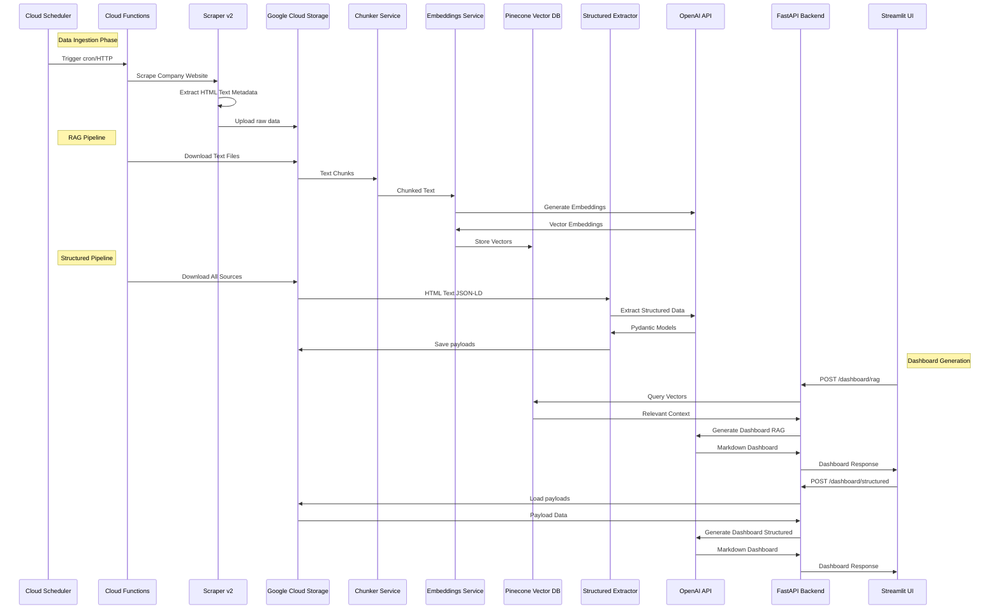
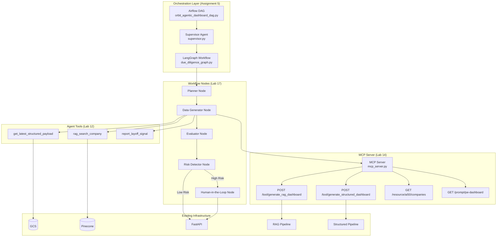
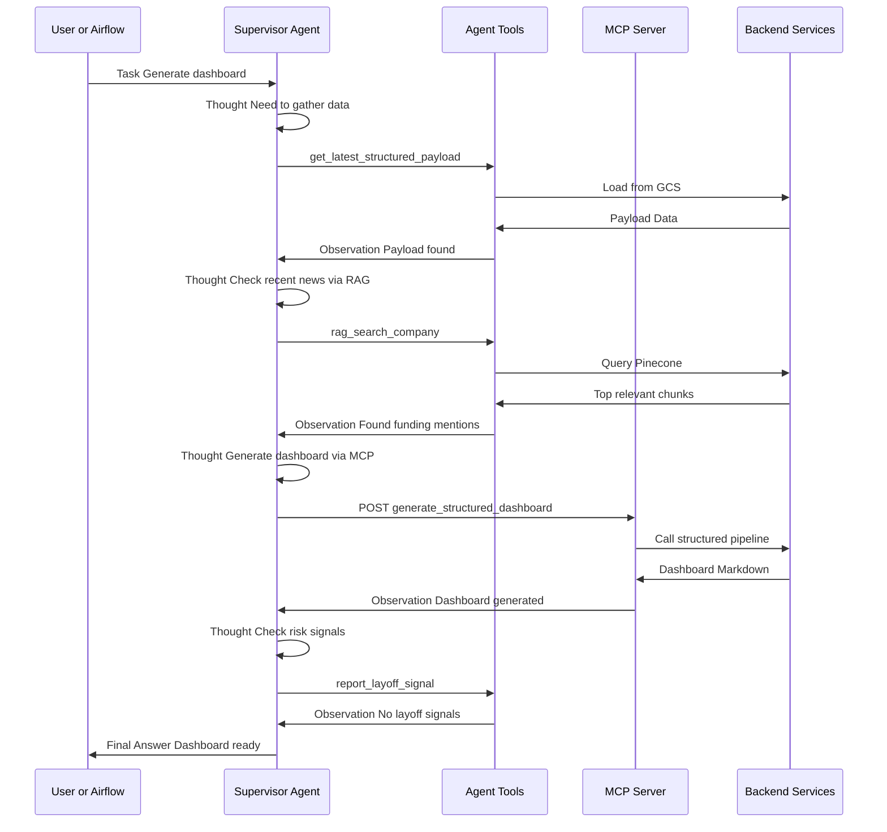
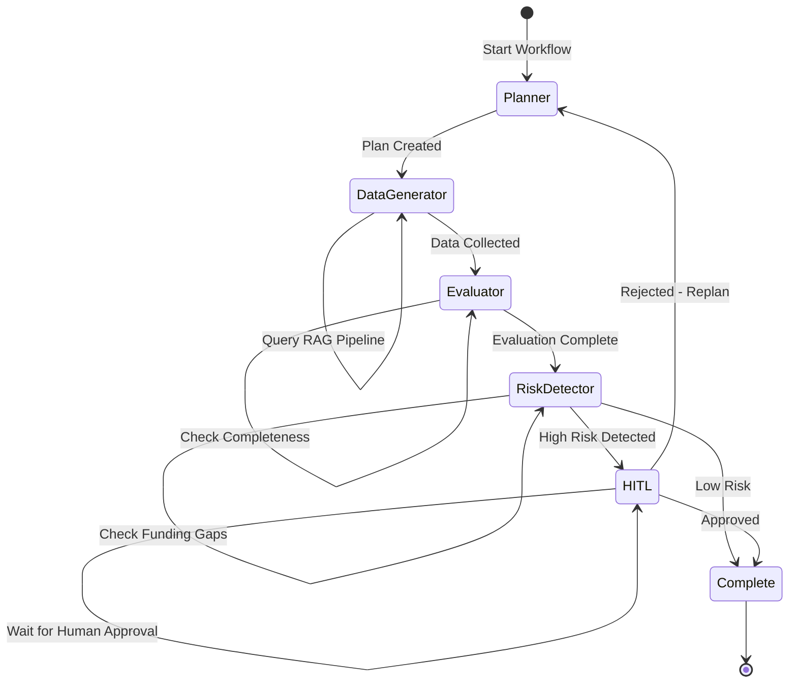
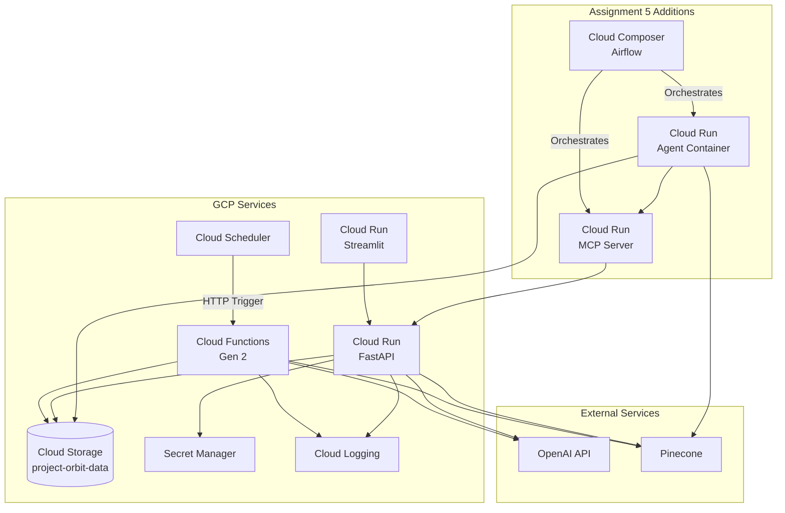

# Project ORBIT - Complete Architecture Diagram

> **⚠️ IMPORTANT**: This is a **Markdown file** with embedded Mermaid diagrams, NOT a pure Mermaid file.
> 
> **To view this file correctly:**
> - **GitHub/GitLab**: Open the file directly - diagrams render automatically
> - **VS Code**: Install "Markdown Preview Mermaid Support" extension, then use Markdown Preview
> - **Other Markdown viewers**: Use a Markdown renderer that supports Mermaid
> 
> **To test individual diagrams:**
> - Copy only the content between ` ```mermaid ` and ` ``` ` for each diagram
> - Paste into [Mermaid Live Editor](https://mermaid.live) to test individual diagrams
> - See `ARCHITECTURE_DIAGRAMS_ONLY.md` for individual diagram code blocks

## Table of Contents
1. [System Overview](#system-overview)
2. [Current State Architecture](#current-state-architecture)
3. [Data Flow Architecture](#data-flow-architecture)
4. [Assignment 5: Agent Infrastructure](#assignment-5-agent-infrastructure)
5. [Component Deep Dive](#component-deep-dive)
6. [Deployment Architecture](#deployment-architecture)
7. [Technology Stack](#technology-stack)

---

## System Overview

Project ORBIT is a comprehensive PE (Private Equity) intelligence platform that automates data collection, processing, and dashboard generation for Forbes AI 50 companies.

### Core Purpose
- **Automated Data Collection**: Scrape company websites, news, job postings
- **Dual Processing Pipelines**: RAG (unstructured) + Structured Extraction (Pydantic)
- **Intelligent Dashboard Generation**: Generate investor-facing diligence reports
- **Agent-Based Orchestration** (Assignment 5): Autonomous decision-making and workflow management

---

## Current State Architecture



---

## Data Flow Architecture

### Complete Data Pipeline Flow



### Storage Structure

```
GCS Bucket: project-orbit-data
│
├── seed/
│   └── forbes_ai50_seed.json          # Company metadata
│
├── raw/
│   └── {company_id}/
│       └── comprehensive_extraction/  # Scraped data
│           ├── homepage.html
│           ├── homepage_clean.txt
│           ├── about.html
│           ├── about_clean.txt
│           ├── blog_posts/
│           │   ├── post_1.html
│           │   └── post_1_clean.txt
│           └── extracted_entities.json
│
├── structured/
│   └── {company_id}.json              # Structured Pydantic models
│
├── payloads/
│   └── {company_id}.json              # Complete payload (all entities)
│
└── scraping_results/
    ├── scraping_results_*.json        # Scraping summaries
    └── structured_extraction_results_*.json
```

---

## Assignment 5: Agent Infrastructure

### Agent Architecture Overview



### ReAct Pattern Flow (Lab 16)



### LangGraph Workflow (Lab 17)



---

## Component Deep Dive

### 1. Scraper v2 (`scraper_v2.py`)

**Purpose**: Comprehensive website scraping with optimized speed

**Key Features**:
- Discovers 12+ page types (homepage, about, jobs, news, blog, etc.)
- Extracts structured data (Schema.org, JSON-LD, microdata)
- ATS API integration (Greenhouse, Lever, Ashby)
- RSS feed extraction
- Smart URL filtering (skips legal, docs, etc.)
- Output: `data/raw/{company_id}/comprehensive_extraction/`

**Output Structure**:
```
comprehensive_extraction/
├── {page_type}.html              # Raw HTML
├── {page_type}_clean.txt         # Cleaned text (trafilatura)
├── blog_posts/
│   ├── post_1.html
│   └── post_1_clean.txt
└── extracted_entities.json       # Structured entities
```

### 2. RAG Pipeline (`rag_pipeline.py`)

**Purpose**: Generate dashboards from unstructured vector data

**Flow**:
1. **Chunking**: Split text into 1000-character chunks
2. **Embedding**: Generate 1536-dim vectors via OpenAI
3. **Storage**: Store in Pinecone with metadata
4. **Retrieval**: Query top-k relevant chunks
5. **Generation**: LLM generates dashboard from context

**Key Functions**:
- `retrieve_context(company_name, top_k=10)`: Query vector DB
- `generate_dashboard(company_name)`: End-to-end generation
- `format_context_for_llm(contexts)`: Format for LLM input

### 3. Structured Extraction (`structured_extraction_v2.py`)

**Purpose**: Extract structured Pydantic models from scraped data

**Extraction Functions**:
- `extract_company_record()`: Company metadata
- `extract_funding_events()`: Funding rounds, amounts, investors
- `extract_leadership()`: Founders, executives, roles
- `extract_products()`: Product names, descriptions, pricing
- `extract_snapshot()`: Headcount, job openings, hiring focus
- `extract_events()`: Partnerships, launches, other events
- `extract_visibility()`: News mentions, sentiment, GitHub stars

**Output**: `Payload` model containing all entities

### 4. FastAPI Backend (`api.py`)

**Endpoints**:
- `GET /companies`: List all Forbes AI 50 companies
- `POST /dashboard/rag`: Generate RAG-based dashboard
- `POST /dashboard/structured`: Generate structured-based dashboard
- `GET /health`: Health check

**Key Features**:
- GCS integration (production) or local filesystem (development)
- Automatic company_id resolution from company_name
- Handles missing payloads gracefully ("Not disclosed" dashboards)
- Validates 8-section dashboard structure

### 5. Agent Tools (Assignment 5 - Lab 12)

**Tool Definitions**:

```python
# src/agents/tools.py

@tool
def get_latest_structured_payload(company_id: str) -> Payload:
    """Retrieve latest structured payload from GCS/local storage"""
    # Loads from payloads/{company_id}.json
    pass

@tool
def rag_search_company(company_id: str, query: str) -> List[Dict]:
    """Search company data in Pinecone vector DB"""
    # Queries Pinecone with company-specific filter
    pass

@tool
def report_layoff_signal(signal_data: LayoffSignal) -> None:
    """Report high-risk layoff signal for human review"""
    # Logs to structured logging system
    pass
```

### 6. MCP Server (Assignment 5 - Lab 14)

**Purpose**: Model Context Protocol server exposing tools/resources/prompts

**Endpoints**:
- `POST /tool/generate_structured_dashboard`: Calls structured pipeline
- `POST /tool/generate_rag_dashboard`: Calls RAG pipeline
- `GET /resource/ai50/companies`: Lists all company IDs
- `GET /prompt/pe-dashboard`: Returns 8-section dashboard template

**Implementation**: FastAPI-based HTTP server

### 7. Supervisor Agent (Assignment 5 - Lab 13)

**Purpose**: Orchestrates agent workflow using ReAct pattern

**Features**:
- LangChain agent with system prompt
- Tool registration and execution
- ReAct loop: Thought → Action → Observation
- Structured logging with correlation IDs

### 8. LangGraph Workflow (Assignment 5 - Lab 17)

**Nodes**:
1. **Planner**: Creates execution plan
2. **Data Generator**: Invokes MCP tools, gathers data
3. **Evaluator**: Scores dashboard quality
4. **Risk Detector**: Analyzes risk signals, branches to HITL if needed
5. **HITL**: Human-in-the-loop approval for high-risk cases

**State Management**: Tracks workflow state, execution path, approvals

---

## Deployment Architecture

### Current Deployment (GCP)



### Docker Containerization

**Current Containers**:
- `api`: FastAPI backend
- `streamlit`: Frontend UI

**Assignment 5 Containers**:
- `mcp-server`: MCP Server (FastAPI)
- `agent`: Supervisor Agent + LangGraph workflow
- `airflow`: Airflow scheduler (optional, or use Cloud Composer)

**docker-compose.yml Structure**:
```yaml
services:
  api:              # FastAPI backend
  streamlit:        # Frontend
  mcp-server:       # MCP Server (Assignment 5)
  agent:            # Agent container (Assignment 5)
  # Optional: Local Airflow for development
```

---

## Technology Stack

### Current Stack

| Layer | Technology | Purpose |
|-------|-----------|---------|
| **Backend** | Python 3.11, FastAPI | API server |
| **Frontend** | Streamlit | Web UI |
| **Scraping** | requests, BeautifulSoup, trafilatura, Playwright | Web scraping |
| **Vector DB** | Pinecone | Embedding storage |
| **LLM** | OpenAI GPT-4o-mini | Dashboard generation |
| **Embeddings** | OpenAI text-embedding-3-small | Vector generation |
| **Structured Data** | Pydantic, Instructor | Data validation |
| **Storage** | Google Cloud Storage | Raw data, payloads |
| **Orchestration** | Cloud Functions, Cloud Scheduler | Automated scraping |
| **Containerization** | Docker, Docker Compose | Local development |

### Assignment 5 Additions

| Component | Technology | Purpose |
|-----------|-----------|---------|
| **Agent Framework** | LangChain, LangGraph | Agent orchestration |
| **MCP** | FastAPI (custom HTTP) | Model Context Protocol |
| **Workflow** | LangGraph | State machine workflow |
| **Logging** | structlog (optional) | Structured logging |
| **Testing** | pytest, pytest-asyncio | Unit/integration tests |
| **Orchestration** | Apache Airflow / Cloud Composer | Agentic DAGs |

---

## File Structure (Complete)

```
project_orbit/
├── src/
│   ├── agents/                    # Assignment 5 - Agent Infrastructure
│   │   ├── __init__.py
│   │   ├── tools.py               # Lab 12: Core agent tools
│   │   ├── supervisor.py          # Lab 13: Supervisor Agent
│   │   └── react_logger.py        # Lab 16: ReAct logging
│   │
│   ├── server/                    # Assignment 5 - MCP Server
│   │   ├── __init__.py
│   │   └── mcp_server.py          # Lab 14: MCP Server
│   │
│   ├── workflows/                 # Assignment 5 - LangGraph
│   │   ├── __init__.py
│   │   └── due_diligence_graph.py # Lab 17: Workflow graph
│   │
│   ├── api.py                     # FastAPI backend
│   ├── scraper_v2.py              # Enhanced scraper
│   ├── structured_extraction_v2.py # Structured extraction
│   ├── rag_pipeline.py            # RAG pipeline
│   ├── models.py                  # Pydantic models
│   ├── gcs_utils.py               # GCS utilities
│   └── services/
│       ├── chunker.py             # Text chunking
│       └── embeddings.py          # Embedding generation
│
├── cloud_functions/               # GCP Cloud Functions
│   ├── main.py                    # Function entry points
│   ├── requirements.txt
│   └── src/                       # Shared source code
│
├── dags/                          # Airflow DAGs
│   ├── ai50_full_ingest_dag.py   # Full ingestion
│   ├── ai50_daily_refresh_dag.py  # Daily refresh
│   └── orbit_agentic_dashboard_dag.py  # Assignment 5: Agentic DAG
│
├── tests/                         # Assignment 5 - Testing
│   ├── test_tools.py              # Lab 12: Tool tests
│   ├── test_mcp_server.py         # Lab 14: MCP tests
│   └── test_workflow_branches.py  # Lab 17: Workflow tests
│
├── config/
│   └── settings_example.yaml      # Assignment 5: Configuration
│
├── docs/
│   ├── ARCHITECTURE_DIAGRAM.md    # This file
│   ├── REACT_TRACE_EXAMPLE.md     # Lab 16: ReAct traces
│   └── WORKFLOW_GRAPH.md          # Lab 17: Workflow diagram
│
├── data/
│   ├── forbes_ai50_seed.json      # Company seed data
│   ├── raw/                       # Scraped data
│   ├── structured/                # Structured JSON
│   └── payloads/                  # Complete payloads
│
├── Dockerfile                     # Current container
├── Dockerfile.mcp                 # Assignment 5: MCP Server
├── Dockerfile.agent               # Assignment 5: Agent container
├── docker-compose.yml             # Multi-container setup
├── .env.example                   # Environment variables
└── mcp_config.json                # Assignment 5: MCP client config
```

---

## Data Flow Summary

### Phase 1: Data Ingestion
1. **Cloud Scheduler** triggers **Cloud Functions**
2. **Scraper v2** scrapes company websites
3. Raw data saved to **GCS**: `raw/{company_id}/comprehensive_extraction/`

### Phase 2: Data Processing (Parallel)

**RAG Pipeline**:
1. Download text files from GCS
2. **Chunker** splits into 1000-char chunks
3. **Embeddings** service generates vectors via OpenAI
4. Store in **Pinecone** with metadata

**Structured Pipeline**:
1. Download all sources from GCS
2. **Structured Extractor** uses Instructor + Pydantic
3. Extract: Company, Events, Leadership, Products, Snapshot, Visibility
4. Save to **GCS**: `payloads/{company_id}.json`

### Phase 3: Dashboard Generation

**RAG Dashboard**:
1. Query **Pinecone** for relevant context (top-k=10)
2. Format context for LLM
3. **OpenAI** generates dashboard from context
4. Validate 8-section structure

**Structured Dashboard**:
1. Load payload from **GCS**: `payloads/{company_id}.json`
2. Convert to JSON for LLM
3. **OpenAI** generates dashboard from structured data
4. Validate 8-section structure

### Phase 4: Agent Orchestration (Assignment 5)

1. **Airflow DAG** triggers **Supervisor Agent**
2. **Supervisor** creates execution plan
3. **LangGraph Workflow** executes:
   - **Planner**: Creates plan
   - **Data Generator**: Invokes MCP tools, gathers data
   - **Evaluator**: Scores dashboard quality
   - **Risk Detector**: Analyzes risks, branches to HITL if needed
4. **MCP Server** exposes tools/resources/prompts
5. **Agent Tools** interact with GCS, Pinecone, backend APIs
6. Final dashboard returned via API

---

## Key Design Decisions

### 1. Dual Pipeline Approach
- **RAG**: Handles unstructured data, semantic search
- **Structured**: Handles structured extraction, zero hallucination

### 2. GCS as Source of Truth
- All raw data, structured data, payloads stored in GCS
- Enables distributed processing, versioning, backup

### 3. Pydantic Models for Validation
- Type-safe data structures
- Automatic validation
- Schema evolution support

### 4. Agent-Based Orchestration (Assignment 5)
- Autonomous decision-making
- ReAct pattern for transparency
- HITL for high-risk scenarios

### 5. MCP for Tool Abstraction
- Standardized tool interface
- Decouples agents from implementation
- Enables tool composition

---

## Future Enhancements

1. **Real-time Updates**: WebSocket support for live dashboard updates
2. **Multi-LLM Support**: Anthropic Claude, Google Gemini integration
3. **Advanced Analytics**: Trend analysis, predictive modeling
4. **Custom Dashboards**: User-defined dashboard templates
5. **Collaboration**: Multi-user annotations, comments
6. **Export Formats**: PDF, Excel, PowerPoint generation
7. **API Rate Limiting**: Protect against abuse
8. **Caching**: Redis for frequently accessed dashboards
9. **Monitoring**: Prometheus + Grafana dashboards
10. **CI/CD**: Automated testing and deployment pipelines

---

## Conclusion

This architecture provides a scalable, maintainable foundation for PE intelligence automation. The addition of agent infrastructure (Assignment 5) enables autonomous decision-making and workflow orchestration, making the system more intelligent and adaptable to changing requirements.

