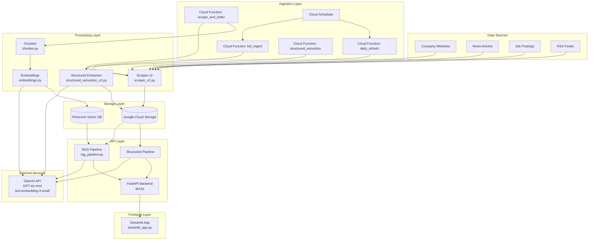
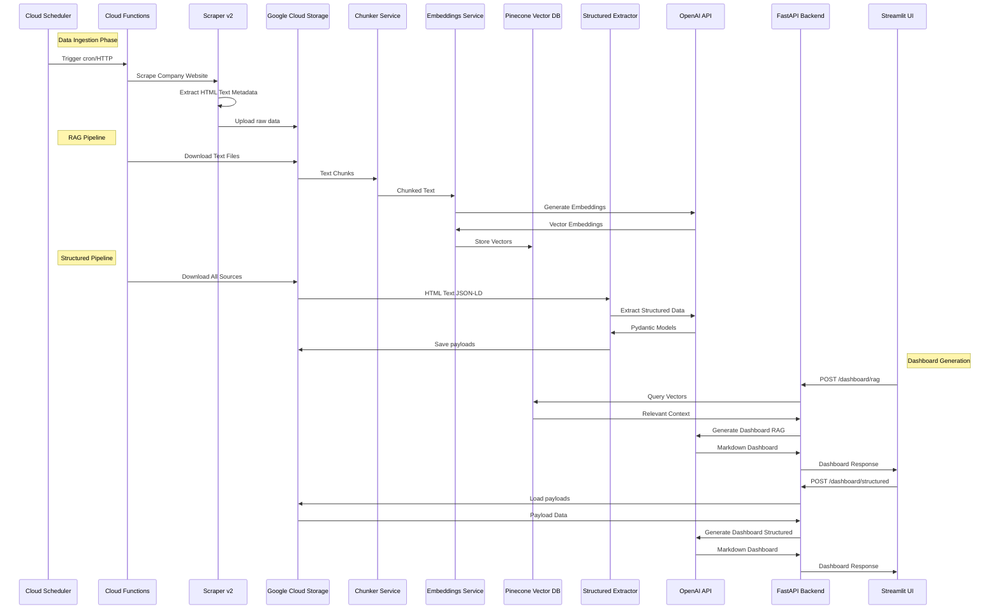
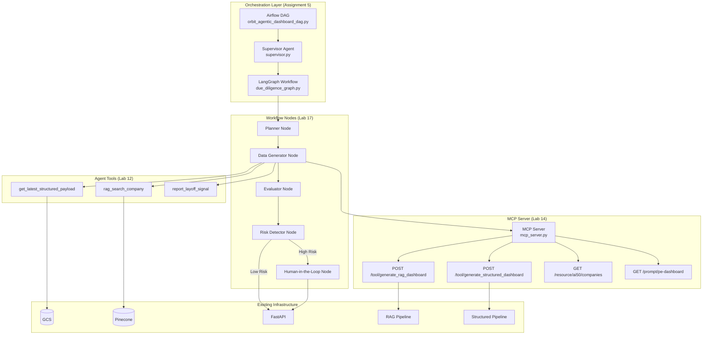
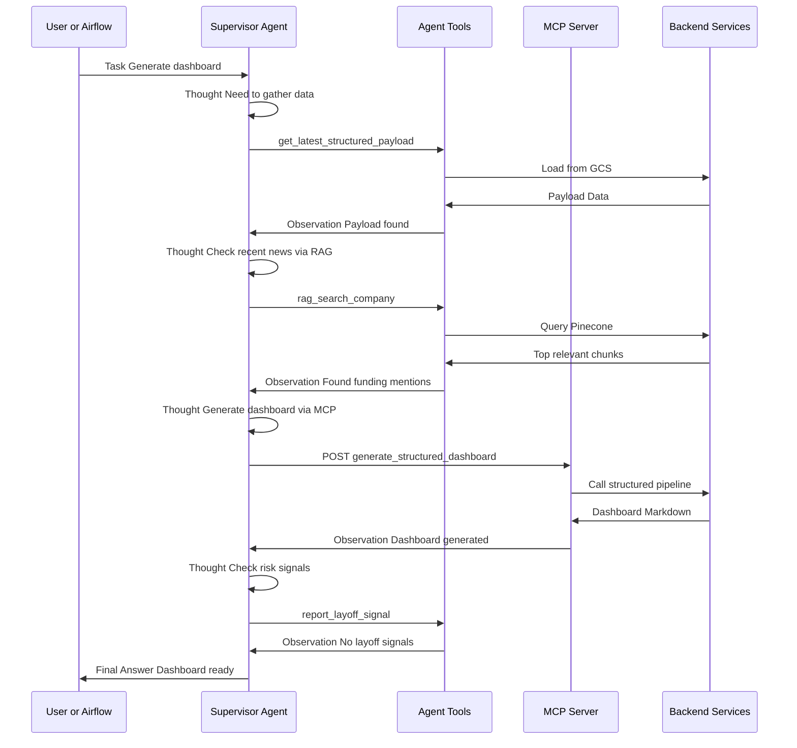
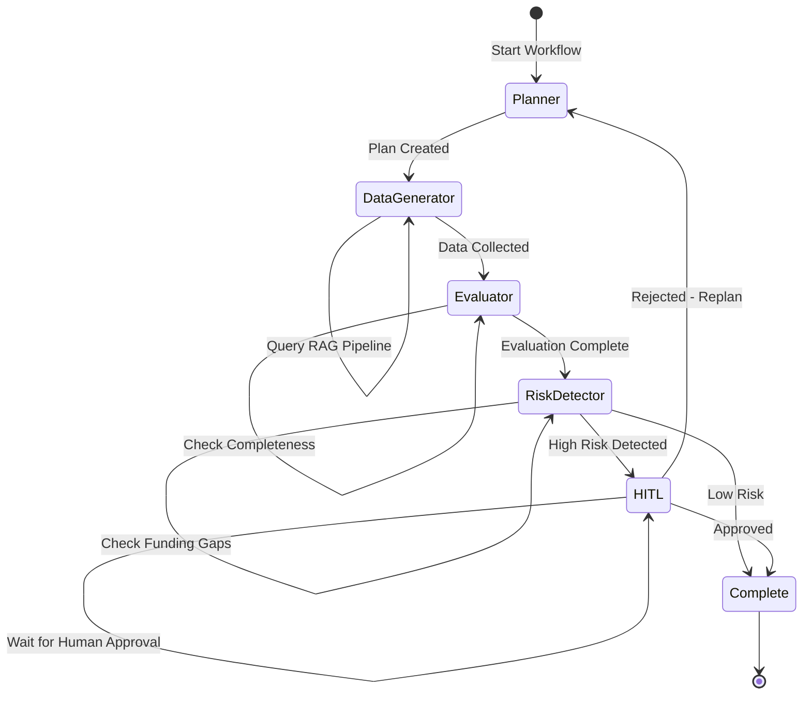
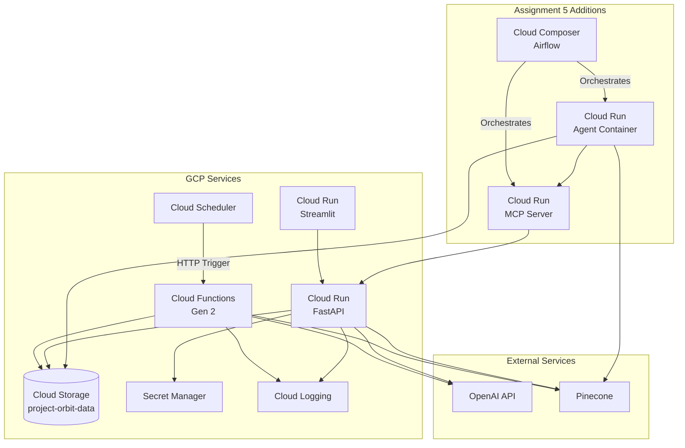

# Project ORBIT - Mermaid Diagrams Only

This file contains individual Mermaid diagrams extracted from the main architecture document. Use these to test diagrams individually in [Mermaid Live Editor](https://mermaid.live).

---

## Diagram 1: Current State Architecture



---

## Diagram 2: Data Pipeline Flow (Sequence)



---

## Diagram 3: Agent Architecture Overview



---

## Diagram 4: ReAct Pattern Flow



---

## Diagram 5: LangGraph Workflow



---

## Diagram 6: Deployment Architecture



---

## How to Use This File

1. **To test a single diagram:**
   - Copy the content between ` ```mermaid ` and ` ``` ` for any diagram above
   - Go to [Mermaid Live Editor](https://mermaid.live)
   - Paste the code and view the rendered diagram

2. **To view all diagrams in context:**
   - Open `ARCHITECTURE_DIAGRAM.md` in GitHub, GitLab, or VS Code with Mermaid support
   - The diagrams will render automatically in the markdown preview

3. **Troubleshooting:**
   - If a diagram doesn't render, check for syntax errors
   - Ensure you're using a Mermaid-compatible viewer
   - Some diagrams may need adjustments for specific Mermaid versions

